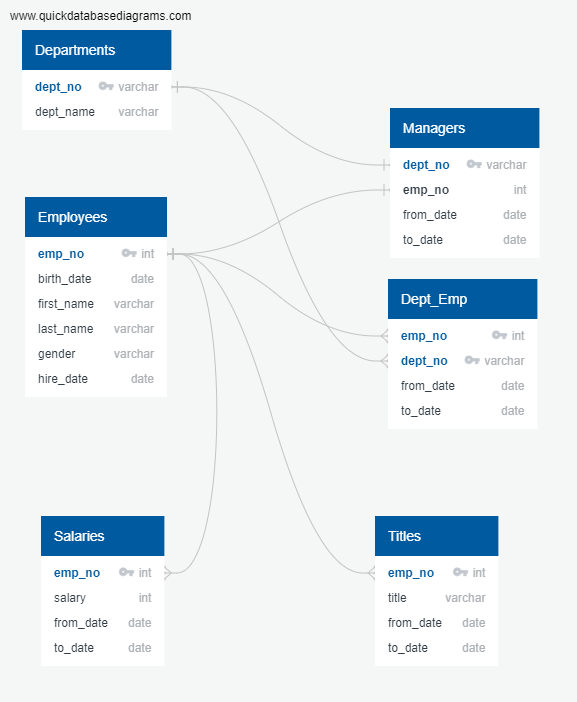

# Pewlett Hackard Analysis Written Analysis
## Introduction and Problem Statement
#### The objective of the project is to gain insight over the workforce at Pewlett Hackard who are near their retirement and project the hiring needs to either eliminate or backfill these positions.

## Summary of Procedures of the Analysis
### Data Gathering
#### First step of the analysis is to gather and understand the relevant data input. Initial data from HR department shows 6 sets of CSV files covering the key information such as employee name, employee number, employment date, title, salary, department, managerial status, etc.. After reviewing the data file, an ERD chart is developed to highlight the relationships among these datasets. Refer to the following figure for the final ERD. With the final ERD, the 6 datasets were imported into PgAdmin tool to form a database.

### Establishing Base Population of Retiring Employees
#### The criteria in order to be eligible for retirement are if an employee (1) was born between January 1st, 1952 and December 31, 1955, (2) with a hire date between January 1st, 1985 and December 31, 1988, and (3) currently actively employeed by the Company (employee to date as January 1st, 9999). Using SELECT command to extract the employee number, first name, and last name from employee data table and with the criteria mentioned above as filter, a subset of the original population is being saved as "current_emp", which will serve as the base population of those employees are eligible for retirement.
### Breaking Down the Base Population by Department
#### The first simple analysis done over the base population is to understand the amount of potential retiring employees by department. In order to achieve this object, the base population (current_emp table) is first joined with dep_emp dataset and then using Count command and group by command, the data is grouped by department number with the count of employee retiring for each department shown. This result is saved as “current_emp_by_dept".
### Additional Lists
#### Using similar SELECT command and JOIN command, 3 additional lists are built and saved as below:
	1. emp_info: This is a list containing a list of the employees eligible for retirement with their name, gender, and salary.
	2. manager_info: This is a list of those retiring employees who are also holding a manager title.
	3. dept_info: This is a list of retiring employees with their department

### Tailored List for Sales and Development Department
#### As tailored list consisting of only sales and Development departments' employees who are retiring eligible are extracted saved as "sales_and_development_dept_info". 

### Challenges and Observations
#### The only challenge that I have encountered is the errors loading the data. There were a couple of types of error messages I experienced. One is due to the order of the columns per CSV file did not match the order created in pgAdmin database causing data import error. After understanding the root cause, the talbe in pgAdmin was removed using DROP TABLE command and recreated making sure the order of the columns matches that in the CSV file. Another type of error messages are related to the order data is imported. The references between the tables requiring the tables are imported in a certain order. The pgAdmin error message is self-explainatory and helpful to resolve the issue.
#### Throughout the analysis, I noticed that the salary data might not be up to date in the source data and the query only returned 5 managers who are retiring. These are potential indication of there might be some issue with the ingegrity of the source data.

## Summary of Results and Recommendations for Additional Analyses
### Summary of Results
#### The total number of current employees retiring is 33118.
#### The total number of individuals available for mentorship role is 15141.
##### * Note to grader: this result is based on the criteria laid out in the module lessons. For module challenges, the result differs as per challenge requirement, the hire date is not a eligiblity criteria for retirement. Only the birth date is considered when filtering retirement eligible employees.
### Recommendations for Additional Analyses
#### Using the existing information we already have, we should consider to analyze on the retirement impact on the gender distribution of the workforce. In modern corporate culture best practice, most of the companies aim to achieve a gender balanced workforce. With the upcoming retirement, it is very likely the the gender equalities within the workforce will be significantly impacted. This analysis will help the HR and Recruiting department to understand the trend and enable them to proactively to adjust the hiring strategies to offset any negative impact.
#### We should also consider bringing the data of employees' work location to analyze the retirement impact over the geographical operation. Perhelps the upcoming retirement will hit certain offices or countries harder than others. In order to maintain a continuity of the local operation, this analysis help the company to better plan the hiring timeline and prioritize the hiring at the locations mostly impacted by the retirement.
